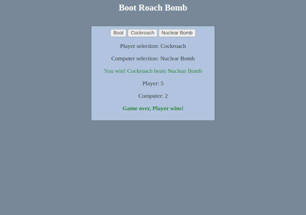

# Boot, Roach, Bomb

## Project info

A fun variant of the classic Rock, Paper, Scissors game! This game is played against AI over the course of five rounds. Ther purpose of this project is to practice basic JavaScript concepts and implement a functioning user interface.

Initial project description can be found [here](https://www.theodinproject.com/lessons/foundations-rock-paper-scissors).

Follow-up project description can be found [here](https://www.theodinproject.com/lessons/foundations-revisiting-rock-paper-scissors).

## Live demo

Live demo available [here](https://jcampbell57.github.io/odin-rock-paper-scissors/)

## Technologies utilized

- HTML5
- CSS3
- JavaScript ES6

## Learning outcomes

This project helped to reinforce the following skills:

- DOM manipulation
- Flexbox
- Git branching

## Project screenshot

## Installation

- Clone this repository to your desktop.
- Navigate to the top level of the directory.
- Open `index.html` in your browser.
